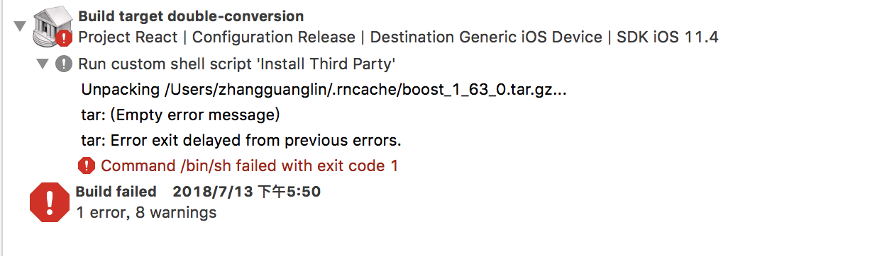
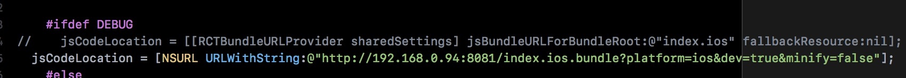

react-native 

----

##1，在mac上初次使用react-native命令，出现如下错误

	xcrun: error: unable to find utility "instruments", not a developer tool or in PATH
	
	
解决办法：

	//在 终端执行如下命令,前提是已经安装xcode
	sudo xcode-select -s /Applications/Xcode.app/Contents/Developer/
	
	
	
	
##2,在react native ,每次删除依赖库后依次运行以下三条记录
	
	//1
	unlink node_modules/react-native/third-party/glog-0.3.4/test-driver
	
	//2
	cd node_modules/react-native/third-party/glog-*

	//3
	../../scripts/ios-configure-glog.sh

##3,react native 解决 'boost/iterator/iterator_adaptor.hpp' file not found’ 及控制台":CFBundleIdentifier", Does Not Exist

	"react-native": "0.46.1"
	这个问题产生原因：
	* /Users/Vanessa/.rncache 中 boost_1_63_0.tar.gz， double-conversion-1.1.5.tar.gz， folly-2016.09.26.00.tar.gz， glog-0.3.4.tar.gz 文件下载不完整
	* node_modules/react-native/third-party 文件不完整（好像是0.45以上的版本出现的））
解决方案：

	//删除 .rncache 后重新下载
	rm -rf node_modules && rm -rf ~/.rncache && yarn install
	
	
3,ios打包问题

##4,android studio 手动引入原生库

在项目如下路径
	
	[项目名]/android/
	
找到配置文件
	
	settings.gradle
	
添加配置描述

	include ':react-native-view-shot'
	project(':react-native-view-shot').projectDir = new File(rootProject.projectDir, '../node_modules/react-native-view-shot/android')
	
	
然后打开Android studio -> 开开 file -> project structure -> dependencies -> 点击加号‘+’ -> module dependency -> 选择需要添加的依赖

android 引入插件库配置

1，[项目名]/android/下

在settings.gradle文件内添加配置，如下

	include ':react-native-view-shot'
	project(':react-native-view-shot').projectDir = new File(rootProject.projectDir, '../node_modules/react-native-view-shot/android')
	
2，[项目名]/android/app/下

build.gradle文件内添加配置，如下

	implementation project(':react-native-view-shot')

3，[项目名]/android/app/src/main/java/下

MainApplication.java文件内添加配置，如下

	import fr.greweb.reactnativeviewshot.RNViewShotPackage;

	new RNViewShotPackage(),

然后重新编译项目

Image 使用gif格式图片只有iOS支持，在安卓上需要添加如下配置

	android/app/build.gradle文件中dependencies模块下添加如下插件
	
	compile 'com.facebook.fresco:fresco:1.5.0'
  	compile 'com.facebook.fresco:animated-gif:1.5.0'
  	
  	
  	
  	
  	
##react native 与 webview之间的通信，

可以通过刚给URL添加参数的形式向webview传递信息，如webview的h5需要登录验证的时候，向如下添加,然后在h5中通过监听URL变化获取参数

	const url = url+`?phone=${[参数]}`

	
h5向react native传递信息可以调用window.postMassage方法，传递一个字符串给react native，然后在react native 中的webview的onMassage属性上获取H5传递过来的字符串数据，数据从even.nativeEvent.data上获取，

如下方法

	onMessage(even) {
    let {data} = even.nativeEvent;
    console.log(data);
    }

##错误

解决方法

http://www.cnblogs.com/AimerXK/p/7747346.html

##ios真机调试

问题:no bundle url present

解决方案:

参考地址 https://www.jianshu.com/p/75eb44ccd4f0
在appdelegate文件中做如下修改,把debug模式下的地址指向本机网络地址

    #ifdef DEBUG
    //jsCodeLocation = [[RCTBundleURLProvider sharedSettings] jsBundleURLForBundleRoot:@"index.ios" fallbackResource:nil];
    jsCodeLocation = [NSURL URLWithString:@"http://192.168.0.101:8081/index.ios.bundle?platform=ios&dev=true&minify=false"];
    

##视图吸顶问题

在react native 中有时需要实现吸顶问题,比如让某一个模块当页面滚动时始终固定咋顶部,在scrollview中有一个stickyHeaderIndices属性,该属性设置一个数组,数组包含scrollview中某一个或多个子元素的下标,该一个或过个子元素会在scrollview滚动时始终固定在顶部.