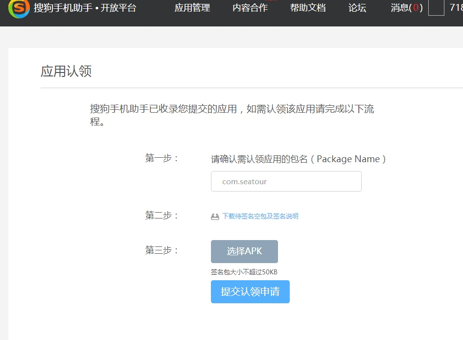

# 应用认领签名

在一些开放平台发布安卓应用，有一步需要进行应用认领，如下

1，在这种情况下，首先按照提示中的第二步下载一个空包

2，添加签名，方法如下

	//签名命令格式（需要安装java se jdk)
	
	jarsigner -verbose -keystore [签名证书路径(带.keystore的文件)] -signedjar [签名后包输出完整路径] [原始包完整路径(这里就是上面下载的空包路径)] [签名中的别名(如下面例子中的‘haiyue’)]

	//例子
	jarsigner -verbose -keystore /Users/os/Desktop/seatour/android/app/release-key.keystore -signedjar /Users/os/Desktop/111/com.seatour.apk /Users/os/Desktop/unpag/unsign.apk haiyue
	
执行命令后还会要求输入密码，输入证书对应的密码后回车即可，然后在上面设置的签名包输出位置找到已经签名的包，然后执行提示中的第三步上传即可

